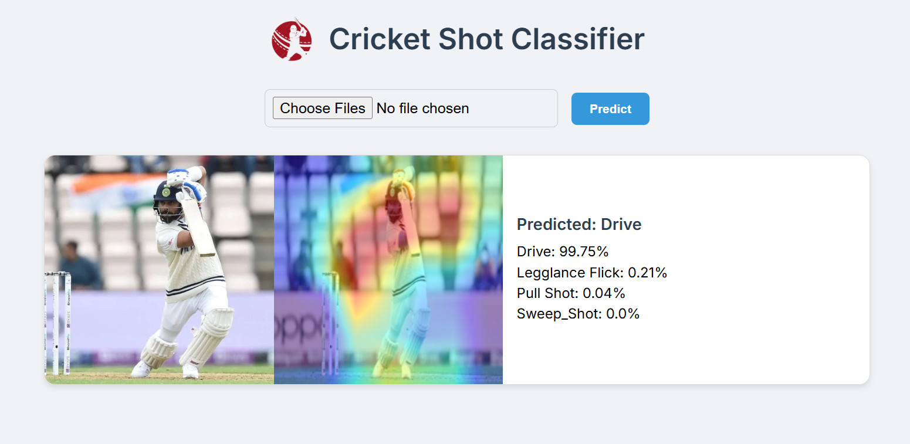
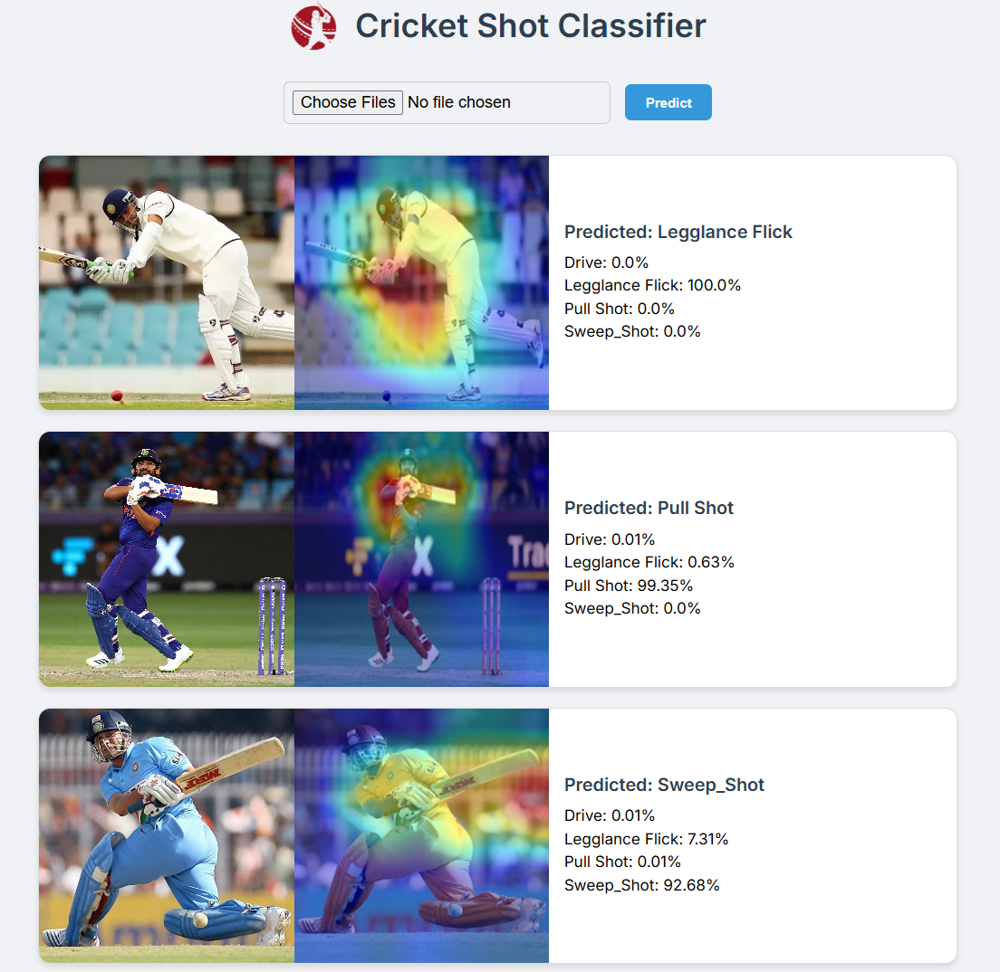

# 🏏 Cricket Shot Classifier Web App



A deep learning-powered web application to classify cricket batting shots from images using a fine-tuned **ResNet50** model. The app supports multi-image uploads, shows class probabilities, and provides **Grad-CAM visualizations** for interpretability.

---

## 🔍 Features

- ✅ Classifies 4 types of cricket shots:
  - `drive`
  - `legglance-flick`
  - `pullshot`
  - `sweep`
- 📊 Predicts class probabilities with softmax confidence
- 🔥 Grad-CAM visualization to highlight important regions
- 🖼️ Upload multiple images at once
- 📦 Flask-based backend with interactive web UI
- 📈 Includes training logs, accuracy/loss plots, and confusion matrix

---

## 🚀 Demo

📷 Upload your cricket batting shot image(s) and view predictions with visual explanations.



---

## 🧠 Model Details

- Backbone: **ResNet50 (pretrained on ImageNet)**
- Fine-tuned with:
  - Last block (`layer4`) + classifier head unfrozen after a few epochs
  - Stratified data splitting
  - Augmented dataset already curated (no further augmentation applied)

### 📈 Training Insights

- Train/Validation accuracy and loss tracked per epoch
- Model checkpoint saved every epoch
- Have a look at the training notebook
  - [`train.ipynb`](train.ipynb)
- Visuals:
  - [`training_stats.png`](training_stats.png)
  - [`confusion_matrix.png`](confusion_matrix.png)

---

## 🛠️ Setup Instructions

### ⚙️ Clone and Install Dependencies

```bash
git clone https://github.com/Sambhaji-Patil/Cricket_shot_classifier.git
cd Cricket_shot_classifier
pip install -r requirements.txt
````

### Train the Model

```bash
python train.py
```

### 🌐 Run the Web App

```bash
python app.py
```

Then open `http://127.0.0.1:5000` in your browser.

---

## 🗂️ Project Structure

```
📦 FlaskUI
├── app.py                     # Flask web server
├── gradcam.py                # Grad-CAM logic
├── predict_image.py          # Model prediction logic
├── train.py                  # Training script
├── checkpoints/              # Saved model weights
├── static/uploads/           # Uploaded + gradcam images
├── templates/index.html      # UI Template
├── screenshots/app_preview.png
└── requirements.txt
```


## 🙌 Acknowledgements

* Inspired by this dataset on [kaggle](https://www.kaggle.com/datasets/aneesh10/cricket-shot-dataset).
* Built using PyTorch & Flask.

---

